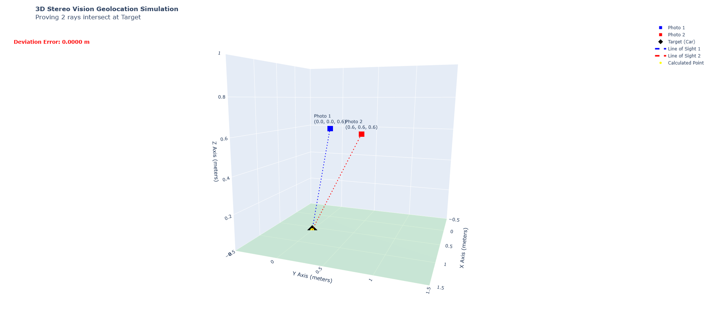
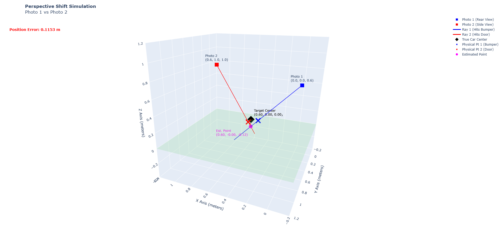
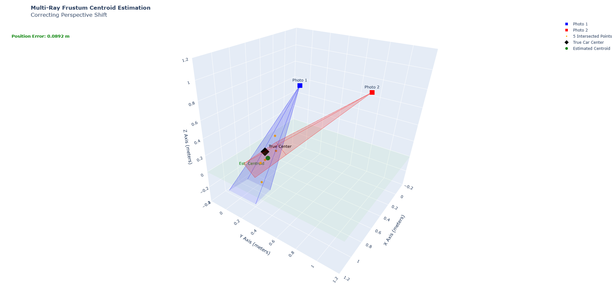

# Volumetric Multi-View Triangulation for UAV 3D Target Geolocation

This repository contains the Python implementation of the terrain-independent volumetric multi-view triangulation algorithm presented in the paper **"Volumetric Multi-View Triangulation for Accurate UAV-based 3D Object Geolocation"** (Accepted, IAAA 2026).

## Overview

Traditional single-view geolocation methods often rely on flat-earth assumptions or require external terrain models (DEMs) to estimate the 3D position of an object. This project implements a perspective-robust, terrain-independent method for 3D target geolocation using a single moving monocular UAV.

By capturing images of a target from two sequential viewpoints, the system:
1. Projects a 5-point bounding box (representing the target's volumetric frustum) from camera coordinate frames into 3D world space.
2. Performs skew-line triangulation across the viewing rays.
3. Computes the 3D target centroid, intrinsically mitigating perspective shifts and reducing localization errors by **22.6%** compared to single-ray projections.

---

## Key Features

- **Sight Vector Projection:** Performs body-to-world frame rotation transformations based on UAV position and attitude telemetry (Roll, Pitch, Yaw).
- **volumetric Frustum Centroid Estimation:** Instead of a single ray, the system projects 5 keypoints of a target bounding box (Center, Top-Left, Top-Right, Bottom-Right, Bottom-Left) to model the view frustum.
- **Skew-Line Triangulation:** Computes the mathematical shortest distance (closest point of intersection) between corresponding rays to estimate the 3D coordinates.

---

## Directory Structure

```
├── src/
│   ├── __init__.py
│   └── geolocation.py        # Core triangulation & sight-vector math
├── tests/
│   ├── __init__.py
│   ├── simulate_3d.py        # 3D visualization of single-ray projection
│   ├── simulate_skew_3d.py   # 3D visualization of skew-line intersection
│   ├── simulate_frustum.py   # 3D visualization of volumetric frustum intersection
│   ├── test_scenarios.py     # Simple test cases for coordinate verification
│   └── test_stereo_*.py      # Integration testing with simulated YOLO outputs
├── main.py                   # Main simulation runner
├── requirements.txt          # Dependencies
└── README.md
```

---

## Visualizations

### 1. Single-Ray Target Intersection
Simulation of a single ray projected from a UAV viewpoint down to a target plane.


### 2. Skew-Line Triangulation
Glow-through representation of two sight vectors that do not intersect perfectly due to telemetry noise, showing the calculated shortest-distance midpoint.


### 3. Volumetric Frustum Intersection (Averaging 5 Points)
The volumetric centroid estimation method projecting and intersecting 5 independent rays to construct the final 3D point cloud of the target.


---

## Mathematical Details

### Sight Vector Rotation
A body frame unit vector $v_{\text{body}} = [1, x_c, -y_c]^T$ is rotated to the world frame using the rotation matrix $R = R_z(\text{Yaw}) R_y(\text{Pitch}) R_x(\text{Roll})$:

$$v_{\text{world}} = R \cdot v_{\text{body}}$$

### Triangulation of Skew Lines
Given two rays $P_1(t) = P_1 + t v_1$ and $P_2(s) = P_2 + s v_2$, we find the closest points by minimizing the distance vector $w(t,s) = P_1(t) - P_2(s)$. The midpoint of the shortest segment connecting the two lines represents the target's estimated 3D position.

---

## Setup & Installation

Ensure you have Python 3.8+ and the required packages installed:

```bash
pip install -r requirements.txt
```

### Running Simulations

To run the standard verification scenarios:

```bash
python main.py
```

To run 3D visual simulations (requires matplotlib):

```bash
python -m tests.simulate_3d
python -m tests.simulate_skew_3d
python -m tests.simulate_frustum_centroid
```

---

## Citation

If you use this code in your research, please cite our paper:

```bibtex
@inproceedings{vo2026volumetric,
  title={Volumetric Multi-View Triangulation for Accurate UAV-based 3D Object Geolocation},
  author={Dang Tran and Vo, Nguyen and Binh Vo},
  booktitle={The 2nd International Conference on Intelligent Aerial Access & Applications (IAAA)},
  year={2026}
}
```
